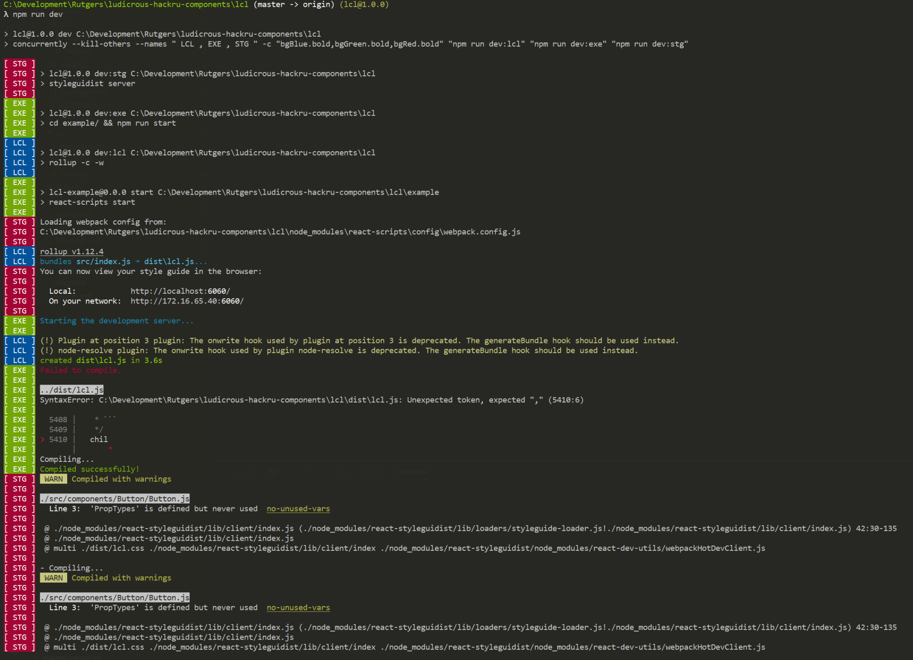

# HackRU: Ludicrous Component Library (LCL)
_"Everything is ludicrous!"_

[](https://www.npmjs.com/package/lcs) [](https://standardjs.com)

## Quick Start
Run the following commands:
```bash
git clone https://github.com/HackRU/ludicrous-hackru-components
cd lcl
npm install
cd examples
npm install
cd ..
npm run dev
```
This will spawn three instances processes:

## License

MIT © [HackRU](https://github.com/hackru) 2019

`HackRU Frontend Team`